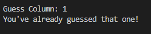

# Battleships Game

## How to play the game
### In my version of Battleships:
- A 5x5 game boards will be randomly generated with a hidden battleship on it.
- The user is prompted for a row and a column which they can input their next guess.
- After each guess the user is told the outcome whether thats a Hit marked by a which would mean they have won the game or a miss marked by 'X'. 
- The goal is the hit the computers battleship before running out of tries.

## Features
- Play against the computer.
- Randomly generated boards with battleship.
- Accepts user input for the guesses.
- Maintains number of incorrect guesses.
- User input validation:
    - Users can't enter co-ordiates that are not on the grid.
    - Only numbers must be entered for guesses.
    - Make sure the same guess hasnt been used already.

# Game Screenshots
## Rules and how to play

## User Input Prompt

## Updated Guess and Board

## Duplicate Guess

## Invalid Guess

## You Lose

## You Win

# Future Features:
### Features i would like to implement into the game are
- Take a name input from the user.
- Allow the user the pick the size of the board
- Allow the user and computer to have seperate boards
- Allow different kinds of battleships spanning diferent sizes on the board.

# User Stories
### First Time Visitor Goals
- As a first time visitor, i want to eaesily understand the rules of the game and how to play it.
- I want to get a clear understanding of the result of each round.
- I want to see updated guess count at the end of every round.
- I want to be made aware of any invalid guesses that I input.
- I want to have fun playing the game.

### Frequent User Goals
- I want to know there is no game-stopping bugs that prevent me from playing the game.
- I want to have fun playing the game.

# Testing
## I have personally tested the project. Steps taken include:
- I put the code through PEP8 linter and it confirmed that there are no problems.
- Played the game several times.
- Gave invalid inputs to the game such as strings and out of bounds inputs and duplicate inputs.
- Tested in my local terminal and the Code Institute Heroku terminal.

# Bugs
### Solved Bugs
- The guess number wasnt increasing for my after every invalid guess. I fixed this but adding the 1 outside of the print statement.
### Remaining Bugs
- There are no remaining bugs

## Validator Testing
- Pep8 was used
    - No errors showed up in Pep8

# Deployment 
- Deployment Method
    - Fork or clone this repository
    - Create a new Heroku app
    - Set the buildbacks to Python and NodeJS in that order
    - Link the Heroku app to the repository
    - Click on Deploy

# Credits
- My mentor for the continuous help and feedback.
- Code Institute for the deployment terminal.

